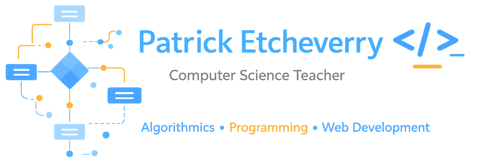

#  About me...

My name is Patrick Etcheverry.

I am a computer science teacher in France, currently working at the [University Institute of Technology of Bayonne](https://www.iutbayonne.univ-pau.fr/).

My work focuses on teaching algorithmics and programming, designing pedagogical resources, and developing educational tools using web technologies and Moodle.

I am also interested in learning analytics and the use of data and AI to better understand how students learn programming.

## Connect with me

&nbsp;&nbsp;

&nbsp;&nbsp;

 
<table style="border-style: hidden;">
<tr>

<td width="60%" valign="top">

## What I do

- Teaching computer science
- Developing pedagogical resources for programming courses  
- Building educational tools with Moodle and web technologies  
- Research in learning analytics and educational technologies  

### Teaching resources
- Algorithmics courses  
- Moodle course design  
- Programming exercises for students  
- Educational web applications
- [Programming tutorials for students](https://patrick-etcheverry.github.io/page-perso-iut/tutoriels/)

### Educational projects

- Algorithmics training platform  
- Moodle interactive course layouts  
- Vulnerable web application for teaching cybersecurity  

### Research interests
- Learning analytics  
- Educational data mining  
- AI for programming education  

</td>

<td width="40%" valign="top">

## Some tools I work with

### Languages

  
  
  
  

### Web

  
  
  
  
  

### Dev tools

  
  
  

### Environment

  
  
  

### Teaching and content

  
  
  
  

</td>

</tr>
</table>

---

